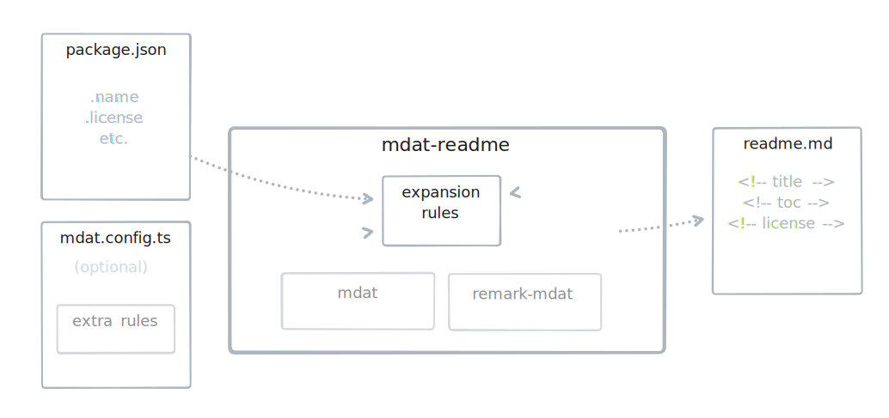

<!--+ Warning: Content in HTML comment blocks generated by mdat on 2024-02-08 +-->

<!-- header -->

# mdat-readme

[](https://npmjs.com/package/mdat-readme)
[](https://opensource.org/licenses/MIT)

**CLI tool and library to automatically populate comment placeholders in readme.md files with metadata from your package.json.**

<!-- /header -->

> \[!NOTE]\
> **Please see the [Mdat Monorepo readme](http://github.com/kitschpatrol/mdat) for additional context.**

<!-- table-of-contents -->

## Table of contents

- [Overview](#overview)
- [Getting started](#getting-started)
  - [Dependencies](#dependencies)
  - [Installation](#installation)
- [Usage](#usage)
  - [Introduction](#introduction)
  - [CLI](#cli)
  - [API](#api)
- [Bundled rules](#bundled-rules)
  - [Stand-alone](#stand-alone)
  - [Compound](#compound)
- [Bundled templates](#bundled-templates)
- [Configuration](#configuration)
- [Customization](#customization)
- [The future](#the-future)
- [Maintainers](#maintainers)
- [Contributing](#contributing)
- [License](#license)

<!-- /table-of-contents -->

## Overview

## Getting started

### Dependencies

The `mdat-readme` CLI tool requires Node 16+. The exported APIs for working directly with Markdown text and documents are ESM-only and share the Node 16+ requirement. `mdat-readme` is implemented in TypeScript and bundles a complete set of type definitions.

### Installation

Install locally to access the CLI commands in a single project or to import the provided APIs:

```sh
npm install mdat-readme
```

Or, install globally for access across your system:

```sh
npm install --global mdat-readme
```

## Usage

> \[!WARNING]\
> **The `mdat-readme` CLI tool directly manipulates the contents of readme files, in close (and perhaps dangerous) proximity to your painstakingly crafted words.**
>
> Please make sure any text you care about is committed before running `mdat-readme`, and never directly modify content inside of the comment expansion blocks.
>
> By default `mdat-readme` adds a warning comment to the top of your file explaining the extra caution demanded around the volatile automated sections of your readme.md.

### Introduction

After installation, add some [comment expansion rules](#bundled-rules) to your readme.md.

Then, run `mdat-readme` to expand the placeholders.

For must use cases, that's in. `mdat-readme` automatically finds your readme.md and package.json.

You can automate the call to `mdat-readme` in a pre-commit hook or similar to ensure your readme is always up to date.

If you're starting from scratch without a readme, take a look at the `mdat-readme init` command to interactively choose between a number of starter templates.

#### Block diagram

`mdat-readme` identifies placeholder comments in your readme.md, matches them to a collection of expansion rules (plus any extras you choose to define), and pulls data from your package.json to generate an "expanded" readme:

<!-- tldraw src: "./assets/mdat-flow.tldr" -->

<picture>
  <source media="(prefers-color-scheme: dark)" srcset="assets/mdat-flow-3aeb9989-dark.svg">
  <source media="(prefers-color-scheme: light)" srcset="assets/mdat-flow-3aeb9989-light.svg">
  
</picture>

<!-- /tldraw -->

### CLI

Full documentation of available commands and options is provided below.

<!-- cli-help -->

#### Command: `mdat-readme`

Use the `mdat` comment expansion system with your readme.md.

This section lists top-level commands for `mdat-readme`.

If no command is provided, `mdat-readme expand` is run by default.

Usage:

```txt
mdat-readme [command] [options]
```

| Command  | Argument    | Description                                                                                                                       |
| -------- | ----------- | --------------------------------------------------------------------------------------------------------------------------------- |
| `expand` | `[options]` | Expand `mdat` comment placeholders in your readme.md using a collection of helpful built-in expansion rules. _(Default command.)_ |
| `clean`  | `[options]` | Collapse all `mdat` comment placeholders in your readme.md.                                                                       |
| `init`   | `[options]` | Interactively Create a new readme.md file with sensible `mdat` comment placeholders.                                              |

_See the sections below for more information on each subcommand._

#### Subcommand: `mdat-readme expand`

Expand `mdat` comment placeholders in your readme.md using a collection of helpful built-in expansion rules.

Usage:

```txt
mdat-readme expand [options]
```

| Option      | Alias | Description                                                                                                                                                                                                   | Type      | Default                                                                                                     |
| ----------- | ----- | ------------------------------------------------------------------------------------------------------------------------------------------------------------------------------------------------------------- | --------- | ----------------------------------------------------------------------------------------------------------- |
| `--readme`  |       | Path to the readme.md file to expand.                                                                                                                                                                         | `string`  | The closest readme.md file is used by default.                                                              |
| `--package` |       | Path to the package.json file to use to populate the readme.                                                                                                                                                  | `string`  | The closest package.json file is used by default.                                                           |
| `--assets`  |       | Path to find and save readme-related assets.                                                                                                                                                                  | `string`  | `./assets`                                                                                                  |
| `--config`  |       | Path(s) to files containing mdat configs.                                                                                                                                                                     | `array`   | Configuration is automatically loaded if found from the usual places, otherwise sensible defaults are used. |
| `--rules`   | `-r`  | Path(s) to files containing additional mdat comment expansion rules.                                                                                                                                          | `array`   |                                                                                                             |
| `--output`  | `-o`  | Output file directory.                                                                                                                                                                                        | `string`  | Same directory as your readme file.                                                                         |
| `--name`    | `-n`  | Output file name.                                                                                                                                                                                             | `string`  | Same directory as input file. Writes directly to your readme file.                                          |
| `--print`   |       | Print the expanded Markdown to stdout instead of saving to a file. Ignores `--output` and `--name` options.                                                                                                   | `boolean` | `false`                                                                                                     |
| `--prefix`  |       | Require a string prefix before all comments to be considered for expansion. Useful if you have a bunch of non-`mdat` comments in your Markdown file, or if you're willing to trade some verbosity for safety. | `string`  |                                                                                                             |
| `--meta`    | `-m`  | Embed an extra comment at the top of the generated Markdown noting the date of generation and warning editors that certain sections of the document have been generated dynamically.                          | `boolean` | `true`                                                                                                      |
| `--check`   | `-c`  | Check your readme for rule violations without expanding comments. Identifies things like missing comment placeholders and incorrect placeholder ordering.                                                     | `boolean` | `false`                                                                                                     |
| `--verbose` |       | Enable verbose logging. All verbose logs and prefixed with their log level and are printed to stderr for ease of redirection.                                                                                 | `boolean` | `false`                                                                                                     |
| `--help`    | `-h`  | Show help                                                                                                                                                                                                     | `boolean` |                                                                                                             |
| `--version` | `-v`  | Show version number                                                                                                                                                                                           | `boolean` |                                                                                                             |

#### Subcommand: `mdat-readme clean`

Collapse all `mdat` comment placeholders in your readme.md.

Usage:

```txt
mdat-readme clean [options]
```

| Option      | Alias | Description                                                                                                                   | Type      | Default                                                                                                     |
| ----------- | ----- | ----------------------------------------------------------------------------------------------------------------------------- | --------- | ----------------------------------------------------------------------------------------------------------- |
| `--readme`  |       | Path to the readme.md file to clean.                                                                                          | `string`  | The closest readme.md file is used by default.                                                              |
| `--config`  |       | Path(s) to files containing mdat configs.                                                                                     | `array`   | Configuration is automatically loaded if found from the usual places, otherwise sensible defaults are used. |
| `--output`  | `-o`  | Output file directory.                                                                                                        | `string`  | Same directory as your readme file.                                                                         |
| `--name`    | `-n`  | Output file name.                                                                                                             | `string`  | Same directory as input file. Writes directly to your readme file.                                          |
| `--print`   |       | Print the expanded Markdown to stdout instead of saving to a file. Ignores `--output` and `--name` options.                   | `boolean` | `false`                                                                                                     |
| `--verbose` |       | Enable verbose logging. All verbose logs and prefixed with their log level and are printed to stderr for ease of redirection. | `boolean` | `false`                                                                                                     |
| `--help`    | `-h`  | Show help                                                                                                                     | `boolean` |                                                                                                             |
| `--version` | `-v`  | Show version number                                                                                                           | `boolean` |                                                                                                             |

#### Subcommand: `mdat-readme init`

Interactively Create a new readme.md file with sensible `mdat` comment placeholders.

Usage:

```txt
mdat-readme init [options]
```

| Option          | Alias | Description                                                                                                                                                                                                                                                                                                                             | Type      | Default                                                                           |
| --------------- | ----- | --------------------------------------------------------------------------------------------------------------------------------------------------------------------------------------------------------------------------------------------------------------------------------------------------------------------------------------- | --------- | --------------------------------------------------------------------------------- |
| `--interactive` | `-i`  | Run the guided interactive `init` process. Set explicitly to `false` to use default values and skip the prompt.                                                                                                                                                                                                                         | `boolean` | `true`                                                                            |
| `--overwrite`   |       | Replace an existing readme file if one is found.                                                                                                                                                                                                                                                                                        | `boolean` | `false`, if an existing readme is found, don't touch it.                          |
| `--output`      | `-o`  | Destination directory for the new readme file.                                                                                                                                                                                                                                                                                          | `string`  | The package root if you're in a package, otherwise the current working directory. |
| `--expand`      | `-e`  | Automatically run `mdat-readme` immediately after creating the readme template.                                                                                                                                                                                                                                                         | `boolean` | `true`                                                                            |
| `--template`    | `-t`  | Specify a template to use for the new readme.                                                                                                                                                                                                                                                                                           | `string`  | "Mdat Readme"                                                                     |
| `--compound`    | `-c`  | Use compound comment version of the template to replace several individual comment placeholders where possible. This combines things like `<!-- title -->`, `<!-- badges -->`, etc. in a single `<!-- header -->` comment. It's less clutter when you're editing, but it's also less explicit. The final readme.md output is identical. | `boolean` | `true`                                                                            |
| `--verbose`     |       | Enable verbose logging. All verbose logs and prefixed with their log level and are printed to stderr for ease of redirection.                                                                                                                                                                                                           | `boolean` | `false`                                                                           |
| `--help`        | `-h`  | Show help                                                                                                                                                                                                                                                                                                                               | `boolean` |                                                                                   |
| `--version`     | `-v`  | Show version number                                                                                                                                                                                                                                                                                                                     | `boolean` |                                                                                   |

<!-- /cli-help -->

<!-- cli-help-note -->

_Meta note: The entire section above was generated automatically by the [`<!-- cli-help -->`](../mdat-readme/src/lib/rules/cli-help/index.ts) mdat expansion rule provided in `mdat-readme`. It dynamically parses the output from `mdat --help` into a markdown table, recursively calling `--help` on subcommands to build a Markdown representation of the help output._

<!-- /cli-help-note -->

#### Examples

##### Basic

Expand `mdat` comments in your readme.md:

```sh
mdat-readme
```

##### Validation

Check your readme.md for validation errors, without modifying it:

```sh
mdat-readme --check
```

##### Additional rules

Additional rules may be defined in a configuration file, or passed explicitly to `mdat-readme`:

```sh
mdat-readme --rules 'rules.ts' 'more-rules.js' 'yet-more-rules.json'
```

#### Create a starter readme from scratch

```sh
mdat-readme init
```

### API

The CLI tool is the easiest approach in most circumstances, but if you'd like to integrate `mdat-readme` functionality in another library, the package exports a collection of functions mirroring the CLI functionality. Type aliases are also provided.

Highlights include:

#### Expand Readme String

```ts
function expandReadmeString(
  markdown: string,
  config?: ExpandReadmeConfig,
  rules?: ExpandReadmeRules,
): Promise<ExpandReadmeStringReport>
```

Takes a string of Markdown and returns it with all `mdat-readme` rules expanded. Note that the returned object includes the name of the `packageFile` found during the expansion process, and a `result` value containing a [VFile](https://github.com/vfile), which includes both the post-conversion Markdown content and additional metadata about the conversion.

To get the Markdown content, simply call `.toString()` on the returned `result` key value.

#### Expand Readme File

```ts
function expandReadmeFile(
  config?: ExpandReadmeConfig,
  rules?: ExpandReadmeRules,
): Promise<ExpandReadmeFileReport>
```

Similar to `expandString()`, but takes a file path and handles setting an optional destination path and file name.

It's up to the caller to actually save the returned VFile object on the `result` key of the returned `ExpandReadmeFileReport`. The [to-vfile](https://www.npmjs.com/package/to-vfile) library makes quick work of writing out VFiles.

## Bundled rules

### Stand-alone

- #### `<!-- title -->`

  The `name` field from `package.json`.

- #### `<!-- banner -->`

  Looks for an image in the `/assets` folder for use as a banner image. Searches for a number of typical names and formats. (The assets path is an `mdat-readme` configuration option.)

- #### `<!-- badges -->`

  Generates badges based on `package.json`. Currently only supports license and NPM version badges.

- #### `<!-- short-description -->`

  The `description` field from `package.json`.

- #### `<!-- table-of-contents -->`

  A table of contents automatically generated by [mdast-util-toc](https://github.com/syntax-tree/mdast-util-toc).

  This rule is also aliased under the `<!-- toc -->` keyword, if you're into the brevity thing.

- #### `<!-- contributing -->`

  Invites issues and pull request, generating links based on `package.json`.

- #### `<!-- license -->`

  Documents the project's license, based on the `license` field from `package.json`.

- #### `<!-- code -->`

  A quick way to embed a code block from elsewhere in your repository. Useful for examples.

- #### `<!-- cli-help -->`

  Automatically transform a CLI command's `--help` output into nicely formatted Markdown tables. The rule also recursively calls `--help` on any subcommands found for inclusion in the output.

  Currently, the rule can only parse help output from [Yargs](https://yargs.js.org)-based tools. If parsing fails, the rule will fall back to show the help output in a regular code block.

- #### `<!-- tldraw -->`

  Allows embedding [tldraw](https://www.tldraw.com) files in your readme. Accepts either a path to a local `.tldr` file, or remote [tldraw](https://www.tldraw.com) URLs.

  Automatically generates both "light" and "dark" SVG variations of the sketch, and emits a `<picture>` element per [GitHub's guidelines](https://docs.github.com/en/get-started/writing-on-github/getting-started-with-writing-and-formatting-on-github/basic-writing-and-formatting-syntax#specifying-the-theme-an-image-is-shown-to) to present the correctly themed image based on the viewer's preferences.

  Generated assets are intelligently hashed to aide in cache busting. For locally referenced files, the image will only be regenerated when the content in the source file changes.

  The implementation is based on [@kitschpatrol/tldraw-cli](https://github.com/kitschpatrol/tldraw-cli), and depends on Puppeteer to generate the assets, so it can be a bit slow. Referencing local files instead of remote URLs is recommended for improved performance.

  This rule is used to embed the diagram at the top of this readme.

### Compound

Compound rules combine several stand-alone rules under a single keyword, which can help reduce comment clutter in your readme's Markdown.

- #### `<!-- header -->`

  Combines a number of rules often applied at the top of a readme into a single keyword. This rule is the equivalent of:

  ```md
  <!-- title -->
  <!-- banner -->
  <!-- badges -->
  <!-- shortDescription -->
  ```

- #### `<!-- footer -->`

  Bundles together rules often applied at the end of a readme. Just two rules at the moment:

  ```md
  <!-- contributing -->
  <!-- license -->
  ```

## Bundled templates

The `init` command provides a number of "starter readme" templates incorporating `mdat-readme` comment placeholders:

- #### Mdat Readme

  The house style. An expansive starting point. Prune to your context and taste. The readme files in this monorepo started from this template.

- #### Standard Readme basic

  Includes only the "required" sections from the [Standard Readme](https://github.com/RichardLitt/standard-readme/blob/main/spec.md) specification. [See an example](https://github.com/RichardLitt/standard-readme/blob/main/example-readmes/minimal-readme.md).

- #### Standard Readme full

  Includes all sections from the [Standard Readme](https://github.com/RichardLitt/standard-readme/blob/main/spec.md) specification. [See an example](https://github.com/RichardLitt/standard-readme/blob/main/example-readmes/maximal-readme.md).

## Configuration

`mdat-readme` adds a few extra configuration keys to the core set provided by `mdat`.

All configuration options may be specified as flags on the `mdat-readme` CLI command, or you can use a configuration file.

Configuration is not required, `mdat-readme` will provide sensible defaults and resolve the location of your `readme.md` and `package.json` dynamically.

The configuration object type is:

```ts
type MdatReadmeConfig = {
  assetsPath?: string // unique to mdat-readme, defaults to './assets'
  packageFile?: string // unique to mdat-readme, found dynamically if undefined
  readmeFile?: string // unique to mdat-readme, found dynamically if undefined
  addMetaComment?: boolean // defaults to true
  closingPrefix?: string // defaults to '/'
  keywordPrefix?: string // defaults to ''
  metaCommentIdentifier?: string // defaults to '+'
  rules?: Rules // the default includes all bundled mdat-readme rules
}
```

A configuration file may be saved in any location and format supported by [cosmicconfig](https://github.com/cosmiconfig/cosmiconfig). (I use a `mdat.config.ts` in the root of my projects.)

See the [configuration](../mdat/readme.md#configuration) section of the `mdat` documentation for more information.

## Customization

The underlying `mdat` rule expansion system is flexible and easy to extend.

See the relevant [sections on configuration](../mdat/readme.md#configuration) in the `mdat` package documentation and the [basic rule examples](../remark-mdat/readme.md#examples) in the `remark-mdat` documentation for more.

## The future

Additional rules:

- Support embedding code documentation snippets via [typedoc](https://github.com/TypeStrong/typedoc) + [typedoc-plugin-markdown](https://github.com/tgreyuk/typedoc-plugin-markdown).
- Support line ranges i the `<!-- code -->` rule.

Improved documentation:

- Describe available rule options.
- More details on defining custom rules.

Recommended workflow integration approach:

- Invoke via hooks / GitHub actions?

## Maintainers

[@kitschpatrol](https://github.com/kitschpatrol)

<!-- footer -->

## Contributing

[Issues](https://github.com/kitschpatrol/mdat/issues) and pull requests are welcome.

## License

[MIT](license.txt) © Eric Mika

<!-- /footer -->
