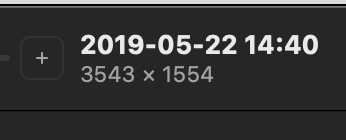

<!--+ Warning: Content in HTML comment blocks generated by mdat on 2024-01-31 +-->

<!-- header -->

# mdat-readme

**Automatically populate comment placeholders in readme.md files with metadata from your package.json.**

<!-- /header -->

<!-- footer -->

## Contributing

[Issues](https://github.com/kitschpatrol/mdat/issues) and pull requests are welcome.

## License

[MIT](license.txt) © Eric Mika

<!-- /footer -->
