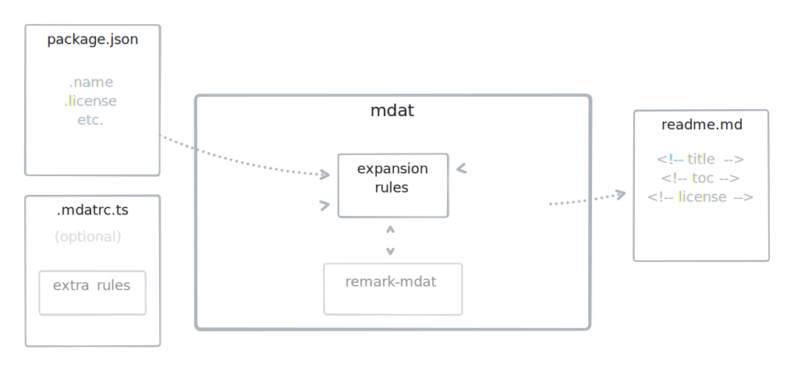

<!--+ Warning: Content inside HTML comment blocks was generated by mdat and may be overwritten. +-->

<!-- header -->

# mdat

[](https://npmjs.com/package/mdat)
[](https://opensource.org/licenses/MIT)

**CLI tool and library implementing the Markdown Autophagic Template (MDAT) system. MDAT lets you use comments as dynamic content templates in Markdown files, making it easy to generate and update readme boilerplate.**

<!-- /header -->

<!-- table-of-contents -->

## Table of contents

- [Overview](#overview)
- [Getting started](#getting-started)
  - [Dependencies](#dependencies)
  - [Installation](#installation)
- [Features](#features)
- [Usage](#usage)
  - [CLI](#cli)
  - [API](#api)
  - [Configuration](#configuration)
  - [Creating custom rules](#creating-custom-rules)
  - [The `mdat readme` subcommand](#the-mdat-readme-subcommand)
- [Background](#background)
  - [Motivation](#motivation)
  - [Similar projects](#similar-projects)
- [The future](#the-future)
- [Maintainers](#maintainers)
- [Acknowledgments](#acknowledgments)
- [Contributing](#contributing)
- [License](#license)

<!-- /table-of-contents -->

## Overview

This is a CLI tool and library implementing the Markdown Autophagic Template (MDAT) system, which makes it easy to automate the replacement of placeholder comments in Markdown documents with dynamic content from a variety of sources. The `mdat` command can also validate the structure and content of the Markdown document based on constraints specified in the expansion rules, and bundles numerous convenient expansion rules for working with `readme.md` files under the `mdat readme` subcommand.

<!-- tldraw src: "./assets/mdat-flow.tldr" -->

<picture>
  <source media="(prefers-color-scheme: dark)" srcset="assets/mdat-flow-63a3366c-dark.svg">
  <source media="(prefers-color-scheme: light)" srcset="assets/mdat-flow-63a3366c-light.svg">
  
</picture>

<!-- /tldraw -->

A trivial example...

Given placeholder comments in a Markdown file like this:

`some-file.md`

```md
<!-- title -->
```

Run your file through the tool:

```sh
mdat readme some-file.md
```

To turn it into:

`some-file.md`

```md
<!-- title -->

# mdat

<!-- /title -->
```

In this case, according to a set of rules defined in an external configuration file, `<!-- title -->` was replaced with date from `package.json`. The rule system behind these expansions is simple to define and readily extensible beyond the trivial example above.

## Getting started

### Dependencies

The `mdat` CLI tool requires Node 16+. The exported APIs for expanding Markdown text and documents are ESM-only and share the Node 16+ requirement. `mdat` is implemented in TypeScript and bundles a complete set of type definitions.

### Installation

Install locally to access the CLI commands in a single project or to import the provided APIs:

```sh
npm install remark-mdat
```

Or, install globally for access across your system:

```sh
npm install --global remark-mdat
```

## Features

As [noted below](#similar-projects), there are several similar projects out there. This overlap is mostly the result of my mediocre due diligence before starting development, but there remain a few distinguishing aspects of this particular implementation of the idea:

1. **Minimalist syntax**

   No screaming caps or wordy opening and closing tag keywords, just a minimal HTML-esque syntax:

   ```md
   <!-- title -->

   # mdat

   <!-- /title -->
   ```

   (Optionally, you can specify a prefix if you want to mix "true" comments with MDAT content placeholder comments.)

2. **Single-comment placeholders**

   When you're roughing out a readme, you can drop in a single opening comment, and `mdat` will take care of expanding it and adding the closing tag the next time it's run. To generate the block shown above, you'd need only to add:

   ```md
   <!-- title -->
   ```

3. **Familiar JSON arguments**

   In the rare instances when you want to pass extra data or configuration into a comment template, you just use a bit of JSON. No need to grok a custom syntax:

   ```md
   <!-- title { prefix: "🙃" } -->
   ```

   Internally, comment option arguments are parsed with [JSON5](https://json5.org), so you can skip quoting keys if you like. A pre-parsing step adds another layer of leniency if you want to skip the brackets or include parentheses to pretend your keyword is a function. The expansion rules included with the `mdat readme` subcommand use [Zod](https://zod.dev) to validate the option arguments and provide helpful errors at runtime.

4. **Flexible rule system**

   Comment expansions definitions are referred to as "rules".

   An expansion rule can be as minimal as a file exporting a record:

   ```ts
   { keyword: "content"}`
   ```

   Which will turn:

   ```md
   <!-- keyword -->
   ```

   Into:

   ```md
   <!-- keyword -->

   content

   <!-- /keyword -->
   ```

   Or, make things a bit more dynamic by returning a function instead of a string. Async functions are welcome.

   ```ts
   { date: () => `${new Date().toISOString()}` } }"
   ```

   Or enforce validation by adding some metadata:

   ```ts
   {
     date: {
       content: () => `${new Date().toISOString()}`,
       order: 1,
       required: true,
     },
   }
   ```

   This scales all the way up to some of the [more](./src/lib/readme/rules/table-of-contents.ts) [elaborate](./src/lib/readme/rules/cli-help) rules found in the `mdat readme` subcommand.

   You can also treat any JSON file as a rule set. MDAT will flatten it to allow any dot-notated key path to become a placeholder comment keyword.

5. **TypeScript native**

   MDAT exports definitions for rule types, and configuration / rule sets may be written directly in TypeScript.

6. **Validation**

   In addition to content replacement, individual rules can define validation constraints. `mdat` includes a `--check` option which runs your expanded Markdown through a validator to enforce the presence and order of appearance of your comment placeholders.

7. **Compound rules**

   It's easy to create "compound" expansion rules that encapsulate a number of other individual rules into a single Markdown comment to keep the quantity of template comments in check.

   See the [`<!-- header -->`](./src/lib/readme/rules/header.ts) rule in the `mdat readme` subcommand for an example.

8. **Single-command readme workflow**

   MDAT's most typical use case is streamlined with the `mdat readme` subcommand. Invoking this CLI command in your repo will automatically find your readme and your package.json and provide access to a collection of bundled expansion rules.

   It also provides the `mdat readme init` subcommand with a selection of templates to kick off a fresh readme from scratch in a new project.

## Usage

> \[!WARNING]\
> **The MDAT CLI tool directly manipulates the contents of readme files, in close (and perhaps dangerous) proximity to your painstakingly crafted words.**
>
> Please make sure any text you care about is committed before running `mdat`, and never directly modify content inside of the comment expansion blocks.
>
> Set the `--meta` flag on the command to add a warning comment to the top of your file explaining the extra caution demanded around the volatile automated sections of your readme.md.

### CLI

<!-- cli-help -->

#### Command: `mdat`

Work with MDAT placeholder comments in any Markdown file.

This section lists top-level commands for `mdat`.

If no command is provided, `mdat expand` is run by default.

Usage:

```txt
mdat [command]
```

| Command    | Argument                | Description                                                    |
| ---------- | ----------------------- | -------------------------------------------------------------- |
| `expand`   | `<files..>` `[options]` | Expand MDAT placeholder comments. _(Default command.)_         |
| `check`    | `<files..>` `[options]` | Validate a Markdown file containing MDAT placeholder comments. |
| `collapse` | `<files..>` `[options]` | Collapse MDAT placeholder comments.                            |
| `readme`   | `[command]`             | Work with MDAT comments in your readme.md.                     |

_See the sections below for more information on each subcommand._

#### Subcommand: `mdat expand`

Expand MDAT placeholder comments.

Usage:

```txt
mdat expand <files..> [options]
```

| Positional Argument | Description                                                    | Type     |
| ------------------- | -------------------------------------------------------------- | -------- |
| `files`             | Markdown file(s) with MDAT placeholder comments. _(Required.)_ | `string` |

| Option      | Alias | Description                                                                                                                                                                                                 | Type      | Default                                                                       |
| ----------- | ----- | ----------------------------------------------------------------------------------------------------------------------------------------------------------------------------------------------------------- | --------- | ----------------------------------------------------------------------------- |
| `--config`  |       | Path(s) to files containing MDAT configuration.                                                                                                                                                             | `array`   | Configuration is loaded if found from the usual places, or defaults are used. |
| `--rules`   | `-r`  | Path(s) to files containing MDAT comment expansion rules.                                                                                                                                                   | `array`   |                                                                               |
| `--output`  | `-o`  | Output file directory.                                                                                                                                                                                      | `string`  | Same directory as input file.                                                 |
| `--name`    | `-n`  | Output file name.                                                                                                                                                                                           | `string`  | Same name as input file. Overwrites the input file.                           |
| `--meta`    | `-m`  | Embed an extra comment at the top of the generated Markdown warning editors that certain sections of the document have been generated dynamically.                                                          | `boolean` |                                                                               |
| `--prefix`  |       | Require a string prefix before all comments to be considered for expansion. Useful if you have a bunch of non-MDAT comments in your Markdown file, or if you're willing to trade some verbosity for safety. | `string`  |                                                                               |
| `--print`   |       | Print the expanded Markdown to stdout instead of saving to a file. Ignores `--output` and `--name` options.                                                                                                 | `boolean` |                                                                               |
| `--verbose` |       | Enable verbose logging. All verbose logs and prefixed with their log level and are printed to stderr for ease of redirection.                                                                               | `boolean` |                                                                               |
| `--help`    | `-h`  | Show help                                                                                                                                                                                                   | `boolean` |                                                                               |
| `--version` | `-v`  | Show version number                                                                                                                                                                                         | `boolean` |                                                                               |

#### Subcommand: `mdat check`

Validate a Markdown file containing MDAT placeholder comments.

Usage:

```txt
mdat check <files..> [options]
```

| Positional Argument | Description                                                    | Type     |
| ------------------- | -------------------------------------------------------------- | -------- |
| `files`             | Markdown file(s) with MDAT placeholder comments. _(Required.)_ | `string` |

| Option      | Alias | Description                                                                                                                                                                                                 | Type      | Default                                                                       |
| ----------- | ----- | ----------------------------------------------------------------------------------------------------------------------------------------------------------------------------------------------------------- | --------- | ----------------------------------------------------------------------------- |
| `--config`  |       | Path(s) to files containing MDAT configuration.                                                                                                                                                             | `array`   | Configuration is loaded if found from the usual places, or defaults are used. |
| `--rules`   | `-r`  | Path(s) to files containing MDAT comment expansion rules.                                                                                                                                                   | `array`   |                                                                               |
| `--meta`    | `-m`  | Embed an extra comment at the top of the generated Markdown warning editors that certain sections of the document have been generated dynamically.                                                          | `boolean` |                                                                               |
| `--prefix`  |       | Require a string prefix before all comments to be considered for expansion. Useful if you have a bunch of non-MDAT comments in your Markdown file, or if you're willing to trade some verbosity for safety. | `string`  |                                                                               |
| `--verbose` |       | Enable verbose logging. All verbose logs and prefixed with their log level and are printed to stderr for ease of redirection.                                                                               | `boolean` |                                                                               |
| `--help`    | `-h`  | Show help                                                                                                                                                                                                   | `boolean` |                                                                               |
| `--version` | `-v`  | Show version number                                                                                                                                                                                         | `boolean` |                                                                               |

#### Subcommand: `mdat collapse`

Collapse MDAT placeholder comments.

Usage:

```txt
mdat collapse <files..> [options]
```

| Positional Argument | Description                                                    | Type     |
| ------------------- | -------------------------------------------------------------- | -------- |
| `files`             | Markdown file(s) with MDAT placeholder comments. _(Required.)_ | `string` |

| Option      | Alias | Description                                                                                                                                                                                                 | Type      | Default                                                                       |
| ----------- | ----- | ----------------------------------------------------------------------------------------------------------------------------------------------------------------------------------------------------------- | --------- | ----------------------------------------------------------------------------- |
| `--config`  |       | Path(s) to files containing MDAT configuration.                                                                                                                                                             | `array`   | Configuration is loaded if found from the usual places, or defaults are used. |
| `--output`  | `-o`  | Output file directory.                                                                                                                                                                                      | `string`  | Same directory as input file.                                                 |
| `--name`    | `-n`  | Output file name.                                                                                                                                                                                           | `string`  | Same name as input file. Overwrites the input file.                           |
| `--prefix`  |       | Require a string prefix before all comments to be considered for expansion. Useful if you have a bunch of non-MDAT comments in your Markdown file, or if you're willing to trade some verbosity for safety. | `string`  |                                                                               |
| `--print`   |       | Print the expanded Markdown to stdout instead of saving to a file. Ignores `--output` and `--name` options.                                                                                                 | `boolean` |                                                                               |
| `--verbose` |       | Enable verbose logging. All verbose logs and prefixed with their log level and are printed to stderr for ease of redirection.                                                                               | `boolean` |                                                                               |
| `--help`    | `-h`  | Show help                                                                                                                                                                                                   | `boolean` |                                                                               |
| `--version` | `-v`  | Show version number                                                                                                                                                                                         | `boolean` |                                                                               |

#### Subcommand: `mdat readme`

Work with MDAT comments in your readme.md.

This section lists top-level commands for `mdat readme`.

If no command is provided, `mdat readme expand` is run by default.

Usage:

```txt
mdat readme [command]
```

| Command           | Argument                | Description                                                                                                                     |
| ----------------- | ----------------------- | ------------------------------------------------------------------------------------------------------------------------------- |
| `readme expand`   | `[files..]` `[options]` | Expand MDAT comment placeholders in your readme.md using a collection of helpful built-in expansion rules. _(Default command.)_ |
| `readme check`    | `[files..]` `[options]` | Validate MDAT placeholder comments in your readme.md.                                                                           |
| `readme collapse` | `[files..]` `[options]` | Collapse MDAT placeholder comments in your readme.md.                                                                           |
| `readme init`     | `[options]`             | Interactively create a new readme.md file with sensible default MDAT comment placeholders.                                      |

_See the sections below for more information on each subcommand._

#### Subcommand: `mdat readme expand`

Expand MDAT comment placeholders in your readme.md using a collection of helpful built-in expansion rules.

Usage:

```txt
mdat readme expand [files..] [options]
```

| Positional Argument | Description                                                                                                       | Type     |
| ------------------- | ----------------------------------------------------------------------------------------------------------------- | -------- |
| `files`             | Readme file(s) with MDAT placeholder comments. If not provided, the closest readme.md file is used. _(Optional.)_ | `string` |

| Option      | Alias | Description                                                                                                                                                                                                 | Type      | Default                                                                       |
| ----------- | ----- | ----------------------------------------------------------------------------------------------------------------------------------------------------------------------------------------------------------- | --------- | ----------------------------------------------------------------------------- |
| `--config`  |       | Path(s) to files containing MDAT configuration.                                                                                                                                                             | `array`   | Configuration is loaded if found from the usual places, or defaults are used. |
| `--rules`   | `-r`  | Path(s) to files containing MDAT comment expansion rules.                                                                                                                                                   | `array`   |                                                                               |
| `--output`  | `-o`  | Output file directory.                                                                                                                                                                                      | `string`  | Same directory as input file.                                                 |
| `--name`    | `-n`  | Output file name.                                                                                                                                                                                           | `string`  | Same name as input file. Overwrites the input file.                           |
| `--package` |       | Path to the package.json file to use to populate the readme.                                                                                                                                                | `string`  | The closest package.json file is used by default.                             |
| `--assets`  |       | Path to find and save readme-related assets.                                                                                                                                                                | `string`  | `./assets`                                                                    |
| `--prefix`  |       | Require a string prefix before all comments to be considered for expansion. Useful if you have a bunch of non-MDAT comments in your Markdown file, or if you're willing to trade some verbosity for safety. | `string`  |                                                                               |
| `--meta`    | `-m`  | Embed an extra comment at the top of the generated Markdown warning editors that certain sections of the document have been generated dynamically.                                                          | `boolean` |                                                                               |
| `--print`   |       | Print the expanded Markdown to stdout instead of saving to a file. Ignores `--output` and `--name` options.                                                                                                 | `boolean` |                                                                               |
| `--verbose` |       | Enable verbose logging. All verbose logs and prefixed with their log level and are printed to stderr for ease of redirection.                                                                               | `boolean` |                                                                               |
| `--help`    | `-h`  | Show help                                                                                                                                                                                                   | `boolean` |                                                                               |
| `--version` | `-v`  | Show version number                                                                                                                                                                                         | `boolean` |                                                                               |

#### Subcommand: `mdat readme check`

Validate MDAT placeholder comments in your readme.md.

Usage:

```txt
mdat readme check [files..] [options]
```

| Positional Argument | Description                                                                                                       | Type     |
| ------------------- | ----------------------------------------------------------------------------------------------------------------- | -------- |
| `files`             | Readme file(s) with MDAT placeholder comments. If not provided, the closest readme.md file is used. _(Optional.)_ | `string` |

| Option      | Alias | Description                                                                                                                                                                                                 | Type      | Default                                                                       |
| ----------- | ----- | ----------------------------------------------------------------------------------------------------------------------------------------------------------------------------------------------------------- | --------- | ----------------------------------------------------------------------------- |
| `--config`  |       | Path(s) to files containing MDAT configuration.                                                                                                                                                             | `array`   | Configuration is loaded if found from the usual places, or defaults are used. |
| `--rules`   | `-r`  | Path(s) to files containing MDAT comment expansion rules.                                                                                                                                                   | `array`   |                                                                               |
| `--package` |       | Path to the package.json file to use to populate the readme.                                                                                                                                                | `string`  | The closest package.json file is used by default.                             |
| `--assets`  |       | Path to find and save readme-related assets.                                                                                                                                                                | `string`  | `./assets`                                                                    |
| `--prefix`  |       | Require a string prefix before all comments to be considered for expansion. Useful if you have a bunch of non-MDAT comments in your Markdown file, or if you're willing to trade some verbosity for safety. | `string`  |                                                                               |
| `--meta`    | `-m`  | Embed an extra comment at the top of the generated Markdown warning editors that certain sections of the document have been generated dynamically.                                                          | `boolean` |                                                                               |
| `--verbose` |       | Enable verbose logging. All verbose logs and prefixed with their log level and are printed to stderr for ease of redirection.                                                                               | `boolean` |                                                                               |
| `--help`    | `-h`  | Show help                                                                                                                                                                                                   | `boolean` |                                                                               |
| `--version` | `-v`  | Show version number                                                                                                                                                                                         | `boolean` |                                                                               |

#### Subcommand: `mdat readme collapse`

Collapse MDAT placeholder comments in your readme.md.

Usage:

```txt
mdat readme collapse [files..] [options]
```

| Positional Argument | Description                                                                                                       | Type     |
| ------------------- | ----------------------------------------------------------------------------------------------------------------- | -------- |
| `files`             | Readme file(s) with MDAT placeholder comments. If not provided, the closest readme.md file is used. _(Optional.)_ | `string` |

| Option      | Alias | Description                                                                                                                                                                                                 | Type      | Default                                                                       |
| ----------- | ----- | ----------------------------------------------------------------------------------------------------------------------------------------------------------------------------------------------------------- | --------- | ----------------------------------------------------------------------------- |
| `--output`  | `-o`  | Output file directory.                                                                                                                                                                                      | `string`  | Same directory as input file.                                                 |
| `--name`    | `-n`  | Output file name.                                                                                                                                                                                           | `string`  | Same name as input file. Overwrites the input file.                           |
| `--print`   |       | Print the expanded Markdown to stdout instead of saving to a file. Ignores `--output` and `--name` options.                                                                                                 | `boolean` |                                                                               |
| `--config`  |       | Path(s) to files containing MDAT configuration.                                                                                                                                                             | `array`   | Configuration is loaded if found from the usual places, or defaults are used. |
| `--prefix`  |       | Require a string prefix before all comments to be considered for expansion. Useful if you have a bunch of non-MDAT comments in your Markdown file, or if you're willing to trade some verbosity for safety. | `string`  |                                                                               |
| `--verbose` |       | Enable verbose logging. All verbose logs and prefixed with their log level and are printed to stderr for ease of redirection.                                                                               | `boolean` |                                                                               |
| `--help`    | `-h`  | Show help                                                                                                                                                                                                   | `boolean` |                                                                               |
| `--version` | `-v`  | Show version number                                                                                                                                                                                         | `boolean` |                                                                               |

#### Subcommand: `mdat readme init`

Interactively create a new readme.md file with sensible default MDAT comment placeholders.

Usage:

```txt
mdat readme init [options]
```

| Option          | Alias | Description                                                                                                                                                                                                                                                                                                                             | Type      | Default                                                  |
| --------------- | ----- | --------------------------------------------------------------------------------------------------------------------------------------------------------------------------------------------------------------------------------------------------------------------------------------------------------------------------------------- | --------- | -------------------------------------------------------- |
| `--interactive` | `-i`  | Run the guided interactive `init` process. Set explicitly to `false` to use default values and skip the prompt.                                                                                                                                                                                                                         | `boolean` | `true`                                                   |
| `--overwrite`   |       | Replace an existing readme file if one is found.                                                                                                                                                                                                                                                                                        | `boolean` | `false`, if an existing readme is found, don't touch it. |
| `--output`      | `-o`  | Output file directory.                                                                                                                                                                                                                                                                                                                  | `string`  | Same directory as input file.                            |
| `--expand`      | `-e`  | Automatically run `mdat readme` immediately after creating the readme template.                                                                                                                                                                                                                                                         | `boolean` | `true`                                                   |
| `--template`    | `-t`  | Specify a template to use for the new readme.                                                                                                                                                                                                                                                                                           | `string`  | "MDAT Readme"                                            |
| `--compound`    | `-c`  | Use compound comment version of the template to replace several individual comment placeholders where possible. This combines things like `<!-- title -->`, `<!-- badges -->`, etc. in a single `<!-- header -->` comment. It's less clutter when you're editing, but it's also less explicit. The final readme.md output is identical. | `boolean` | `true`                                                   |
| `--verbose`     |       | Enable verbose logging. All verbose logs and prefixed with their log level and are printed to stderr for ease of redirection.                                                                                                                                                                                                           | `boolean` |                                                          |
| `--help`        | `-h`  | Show help                                                                                                                                                                                                                                                                                                                               | `boolean` |                                                          |
| `--version`     | `-v`  | Show version number                                                                                                                                                                                                                                                                                                                     | `boolean` |                                                          |

<!-- /cli-help -->

_Meta note: The entire section above was generated automatically by the [`<!-- cli-help -->`](./src/lib/readme/rules/cli-help/index.ts) mdat expansion rule provided in `mdat readme` subcommand. It dynamically parses the output from `mdat --help` into a Markdown table, recursively calling `--help` on subcommands to build a tidy representation of the help output._

#### Examples

##### Basic

Expand comments in a single Markdown file in-place:

```sh
mdat your-file.md
```

##### Multi-file

Expand comments in multiple Markdown files:

```sh
mdat *.md
```

##### Custom configuration

A number of option flags are exposed on the CLI. Any values set here will override both ambient configuration files and any configuration file referenced passed as options:

```sh
mdat  --prefix 'mm-
```

##### Custom configuration file

```sh
mdat  --config 'custom-config.ts"
```

##### Rule sets

```sh
mdat --rules 'rules.ts' 'more-rules.js' 'yet-more-rules.json'
```

##### Readme expansion

Expand MDAT comments in your readme.md:

```sh
mdat readme
```

##### Validation

Check your readme.md for validation errors, without modifying it:

```sh
mdat readme check
```

##### Additional rules

Additional rules may be defined in a configuration file, or passed explicitly to most `mdat` commands via the `--rules` flag:

```sh
mdat readme --rules rules.ts more-rules.js yet-more-rules.json
```

#### Create a starter readme from scratch

```sh
mdat readme init
```

### API

`mdat` exports a collection of functions to abstract the process of expanding placeholder comments into a single call. Type aliases are also provided.

Highlights include:

#### Expand String

```ts
function expandString(markdown: string, config?: ConfigToLoad, rules?: RulesToLoad): Promise<VFile>
```

Takes a string of Markdown and returns. Note that the returned object is a [VFile](https://github.com/vfile), which includes both the post-conversion Markdown content and additional metadata about the conversion.

To get the Markdown content, simply call `.toString()` on the returned VFile object.

#### Expand File

```ts
function expandFile(
  file: string,
  name?: string,
  output?: string,
  config?: ConfigToLoad,
  rules?: RulesToLoad,
): Promise<VFile>
```

Similar to `expandString()`, but takes a file path and handles setting an optional destination path and file name.

It's up to the caller to actually save the returned VFile object. The [to-vfile](https://www.npmjs.com/package/to-vfile) library can make this particularly painless:

```ts
import { expandFile } from 'mdat'
import { write } from 'to-vfile'

const file = await expandFiles(...)
await write(file)
```

#### Expand Files

```ts
function expandFiles(
  files: string[],
  name?: string,
  output?: string,
  config?: ConfigToLoad,
  rules?: RulesToLoad,
): Promise<VFile[]>
```

Like `expandFile()`, but accepts an array of inputs. If an output name is specified, the output files are suffixed with a number to prevent name collisions.

#### Load Config

```ts
function loadConfig(options?: {
  additionalConfig?: ConfigToLoad // file paths or config objects
  additionalRules?: RulesToLoad // file paths or rule objects
  searchFrom?: string
}): Promise<ConfigLoaded> // returns a single merged config object
```

This is provided for more advanced use cases. It assists in discovering and loading ambient configuration in your project (e.g. fields in your package.json, or dedicated `mdat` config files). It also dynamically loads, validates, and merges additional `mdat` configuration and rule files into a final `ConfigLoaded` object ready to be passed into the [`remark-mdat`](../remark-mdat/readme.md) plugin or one of the API functions like `expandFile()`.

#### Examples

### Configuration

Expansion rules and certain aspects of global configuration are defined in configuration files which may be discovered automatically by `mdat`, or explicitly provided via command line options or library function arguments as shown above.

`mdat` implements configuration loading via [cosmiconfig](https://github.com/cosmiconfig/cosmiconfig), which means a variety of configuration [locations](https://github.com/cosmiconfig/cosmiconfig?tab=readme-ov-file#searchplaces) and file formats are supported. Configuration may be defined directly in your package.json, or in addition to stand-alone TypeScript files, JavaScript files, YAML, JSON, etc.

TypeScript or JavaScript with JSDoc annotations are recommended for the most flexibility and ease of implementing more advanced rules.

`mdat` also allows arbitrary JSON files to be loaded as rule sets, flattening them so any value may be accessed by using a dot-notation key path as a comment keyword.

#### Configuration file format

The `mdat` configuration file is a record object allowing you to customize aspects of the comment expansion process, and also optionally define expansion rules as well under the `rules` key:

```ts
type Config = {
  assetsPath?: string // where asset-generating rules should store their output, defaults to './assets'
  packageFile?: string // used by readme rules, found dynamically if undefined
  addMetaComment?: boolean // defaults to true
  closingPrefix?: string // defaults to '/'
  keywordPrefix?: string // defaults to ''
  metaCommentIdentifier?: string // defaults to '+'
  rules?: Rules
}
```

A valid configuration file default-exports an object conforming to the above type.

The configuration file may be located in any location supported by [cosmicconfig](https://github.com/cosmiconfig/cosmiconfig?tab=readme-ov-file#searchplaces). I use an `.mdatrc.ts` file in the root of my projects.

#### Rule file format

Rules may also be defined in separate files that default-export a record of rules. The record keys become the keywords used to reference a rule from your comments in Markdown.

```ts
type Rules = Record<string, Rule>

type Rule =
  | string
  | ((options: JsonValue, tree: Root) => Promise<string> | string)
  | Rule[]
  | {
      content: string | Rule[] | ((options: JsonValue, tree: Root) => Promise<string> | string)
      applicationOrder?: number | undefined
      order?: number | undefined
      required?: boolean | undefined
    }
```

This is a bit complex, but it's intended to make defining simple rules simple, while still accommodating more demanding use cases.

Some notes on the type:

- Simple rules can be defined directly on the key, either as strings to replace the comment placeholder, or as sync or async functions returning a string.

- If you need more advanced rules, or wish to define conditions for the validation process, you break the top-level keyword key's value out into an object, where a `content` key on the object is responsible for returning the replacement string, and additional fields are available to define validation constraints.

- Note that `content` can itself take an array of Rule objects, which is useful for creating "compound" rules that combine several others into a single comment keyword.

Since it's a record, multiple rules may be combined in single rules file.

If multiple configuration and rule files are loaded, they are merged. CLI options take precedence over ambient configuration discovered by cosmicconfig, and where multiple configuration or rule files are provided, with the "last" rule of a particular key takes precedence.

### Creating custom rules

The underlying rule expansion system is flexible and easy to extend.

See the [Examples section](../remark-mdat/readme.md#examples) of the `remark-mdat` readme, or take a look at the implementation of the [rules provided through the `mdat readme` subcommand](./src/lib/readme/rules/) for more complex examples.

### The `mdat readme` subcommand

#### Bundled rules

##### Stand-alone:

- ###### `<!-- title -->`

  The `name` field from `package.json`.

- ###### `<!-- banner -->`

  Looks for an image in the `/assets` folder for use as a banner image. Searches for a number of typical names and formats. (The assets path may be specified through configuration files or command line flags.)

- ###### `<!-- badges -->`

  Generates badges based on `package.json`. Currently only supports license and NPM version badges.

- ###### `<!-- description -->`

  The `description` field from `package.json`.

  This rule is also aliased under the `<!-- short-description -->` keyword, for consistency with the [standard-readme](https://github.com/RichardLitt/standard-readme/blob/main/spec.md#short-description) spec.

- ###### `<!-- table-of-contents -->`

  A table of contents automatically generated by [mdast-util-toc](https://github.com/syntax-tree/mdast-util-toc).

  This rule is also aliased under the `<!-- toc -->` keyword, if you're into the brevity thing.

- ###### `<!-- contributing -->`

  Invites issues and pull request, generating links based on `package.json`.

- ###### `<!-- license -->`

  Documents the project's license, based on the `license` field from `package.json`.

- ###### `<!-- code -->`

  A quick way to embed a code block from elsewhere in your repository. Useful for examples.

- ###### `<!-- cli-help -->`

  Automatically transform a CLI command's `--help` output into nicely formatted Markdown tables. The rule also recursively calls `--help` on any subcommands found for inclusion in the output.

  Currently, the rule can only parse help output from [Yargs](https://yargs.js.org)-based tools. If parsing fails, the rule will fall back to show the help output in a regular code block.

- ###### `<!-- tldraw -->`

  Allows embedding [tldraw](https://www.tldraw.com) files in your readme. Accepts either a path to a local `.tldr` file, or remote tldraw URLs.

  Automatically generates both "light" and "dark" SVG variations of the sketch, and emits a `<picture>` element per [GitHub's guidelines](https://docs.github.com/en/get-started/writing-on-github/getting-started-with-writing-and-formatting-on-github/basic-writing-and-formatting-syntax#specifying-the-theme-an-image-is-shown-to) to present the correctly themed image based on the viewer's preferences.

  Generated assets are intelligently hashed to aide in cache busting. For locally referenced files, the image will only be regenerated when the content in the source file changes.

  The implementation is based on [@kitschpatrol/tldraw-cli](https://github.com/kitschpatrol/tldraw-cli), and depends on Puppeteer to generate the assets, so it can be a bit slow. Referencing local files instead of remote URLs is recommended for improved performance.

  This rule is used to embed the diagram at the top of this readme.

##### Compound

Compound rules combine several stand-alone rules under a single keyword, which can help reduce comment clutter in your readme's Markdown.

- ###### `<!-- header -->`

  Combines a number of rules often applied at the top of a readme into a single keyword. This rule is the equivalent of:

  ```md
  <!-- title -->
  <!-- banner -->
  <!-- badges -->
  <!-- shortDescription -->
  ```

- ###### `<!-- footer -->`

  Bundles together rules often applied at the end of a readme. Just two rules at the moment:

  ```md
  <!-- contributing -->
  <!-- license -->
  ```

#### Bundled templates

The `init` command provides a number of "starter readme" templates incorporating MDAT comment placeholders:

- ##### MDAT Readme

  The house style. An expansive starting point. Prune to your context and taste. The readme files in this monorepo started from this template.

- ##### Standard Readme basic

  Includes only the "required" sections from the [Standard Readme](https://github.com/RichardLitt/standard-readme/blob/main/spec.md) specification. [See an example](https://github.com/RichardLitt/standard-readme/blob/main/example-readmes/minimal-readme.md).

- ##### Standard Readme full

  Includes all sections from the [Standard Readme](https://github.com/RichardLitt/standard-readme/blob/main/spec.md) specification. [See an example](https://github.com/RichardLitt/standard-readme/blob/main/example-readmes/maximal-readme.md).

## Background

### Motivation

A package definition file like `package.json` is the canonical "single source of truth" for a project's metadata. Yet fragments of this metadata end up duplicated elsewhere, most prominently in the readme. Keeping them in sync is a pain.

You could set up a separate readme template file and use one of a to generate your readme, but then you'd still have to wire up data ingestion and deal with and the cognitive clutter of a second half-baked readme in your repo.

MDAT solves this tedium by committing a minor sacrilege: It allows comments in Markdown files to become placeholders for dynamic content, overwriting themselves in place with content pulled from around your repo. When `mdat` is run against the file, specific comments are expanded with content from elsewhere, the file is updated in-situ.

I wrote it for use in my own projects, but if someone else finds it useful, that's great.

### Similar projects

This has been done several times before:

- Benjamin Lupton's [projectz](https://github.com/bevry/projectz)\
  Goes way back.

- David Wells' [Markdown Magic](https://github.com/DavidWells/markdown-magic)\
  I somehow missed the existence of this one until after building out MDAT. It's very similar conceptually, and has a nice ecosystem of plugins.

- Titus Wormer's [mdast-zone](https://github.com/syntax-tree/mdast-zone)\
  Allows comments to be used as ranges or markers in Markdown files. Similar tree parsing and walking strategy to MDAT. Mdast-zone uses different syntax for arguments, and requires both opening and closing tags to be present for expansion to occur.

- lillallol's [md-in-place](https://www.npmjs.com/package/md-in-place)

## The future

Additional rules:

- Support embedding code documentation snippets via [typedoc](https://github.com/TypeStrong/typedoc) + [typedoc-plugin-markdown](https://github.com/tgreyuk/typedoc-plugin-markdown).
- Support line ranges i the `<!-- code -->` rule.

Improved documentation:

- Describe available rule options.
- More details on defining custom rules.

Recommended workflow integration approach:

- Invoke via hooks / GitHub actions?

## Maintainers

[@kitschpatrol](https://github.com/kitschpatrol)

## Acknowledgments

- The [unified](https://unifiedjs.com), [remark](https://remark.js.org), and [unist](https://github.com/syntax-tree/unist) / [mdast](https://github.com/syntax-tree/mdast) ecosystem is powerful and well-architected. MDAT relies on it to do the the heavy lifting in of parsing, transforming, and restoring the Markdown to string form.

- Richard Litt's [Standard Readme](https://github.com/RichardLitt/standard-readme) specification inspired some of the templates available in `mdat readme init`.

<!-- footer -->

## Contributing

[Issues](https://github.com/kitschpatrol/mdat/issues) and pull requests are welcome.

## License

[MIT](license.txt) © Eric Mika

<!-- /footer -->
