<!--+ Warning: Content inside HTML comment blocks was generated by mdat and may be overwritten. +-->

<!-- title -->

# mdat

<!-- /title -->

<!-- badges -->

[](https://npmjs.com/package/mdat)
[](https://opensource.org/licenses/MIT)

<!-- /badges -->

<!-- description -->

**CLI tool and TypeScript library implementing the Markdown Autophagic Template (MDAT) system. MDAT lets you use comments as dynamic content templates in Markdown files, making it easy to generate and update readme boilerplate.**

<!-- /description -->

<!-- table-of-contents -->

## Table of contents

- [Overview](#overview)
- [Getting started](#getting-started)
  - [Dependencies](#dependencies)
  - [Installation](#installation)
- [Features](#features)
- [Usage](#usage)
  - [CLI](#cli)
  - [API](#api)
  - [Configuration](#configuration)
  - [Creating custom rules](#creating-custom-rules)
  - [Bundled rules](#bundled-rules)
- [Plugins](#plugins)
  - [Installing a rule plugin](#installing-a-rule-plugin)
  - [Creating a rule plugin](#creating-a-rule-plugin)
  - [Available rule plugins](#available-rule-plugins)
- [Migrating from 1.x to 2.x](#migrating-from-1x-to-2x)
  - [Flat CLI commands](#flat-cli-commands)
  - [Polyglot metadata](#polyglot-metadata)
  - [Simplified configuration](#simplified-configuration)
  - [Stricter argument syntax](#stricter-argument-syntax)
  - [New functionality](#new-functionality)
  - [Rule shape changes](#rule-shape-changes)
- [Background](#background)
  - [Motivation](#motivation)
  - [Similar projects](#similar-projects)
  - [Implementation notes](#implementation-notes)
- [Maintainers](#maintainers)
- [Acknowledgments](#acknowledgments)
- [Contributing](#contributing)
- [License](#license)

<!-- /table-of-contents -->

## Overview

MDAT is a CLI tool and library that uses HTML comments in Markdown files as placeholders for dynamic content. Write a comment like `<!-- title -->`, run `mdat`, and it expands into real content pulled from your project metadata. Bundled rules handle common readme sections automatically, and custom rules let you easily extend it to output almost anything.

<!-- tldraw({src: "assets/mdat-flow.tldr"}) -->

<picture>
  <source media="(prefers-color-scheme: dark)" srcset="assets/mdat-flow-63a3366c-dark.svg">
  <source media="(prefers-color-scheme: light)" srcset="assets/mdat-flow-63a3366c-light.svg">
  
</picture>

<!-- /tldraw -->

A trivial example...

Given placeholder comments in a Markdown file like this:

`some-file.md`

```md
<!-- title -->
```

Run your file through the tool:

```sh
mdat some-file.md
```

To get:

`some-file.md`

```md
<!-- title -->

# mdat

<!-- /title -->
```

The `<!-- title -->` comment was expanded with content derived from your project's metadata. The rule system behind these expansions is simple to define and readily extensible.

## Getting started

### Dependencies

Node 22+ (specifically `>=22.17.0`). Written in TypeScript with bundled type definitions.

### Installation

Install locally to access the CLI and API in a single project:

```sh
pnpm install mdat
```

Or install globally:

```sh
pnpm install --global mdat
```

## Features

1. **Minimalist syntax**

   No screaming caps or wordy opening and closing tag keywords:

   ```md
   <!-- title -->

   # mdat

   <!-- /title -->
   ```

2. **Single-comment placeholders**

   Drop in a single opening comment and `mdat` adds the closing tag on expansion:

   ```md
   <!-- title -->
   ```

3. **JSON arguments**

   Pass extra data or configuration into a comment template with JSON:

   ```md
   <!-- title({ prefix: "🙃" }) -->
   ```

   Arguments are parsed with [JSON5](https://json5.org), so quoting keys is optional. The bundled readme rules use [Zod](https://zod.dev) to validate arguments.

4. **Flexible rule system**

   Rules range from a single key-value pair:

   ```ts
   export default { keyword: 'content' }
   ```

   To async functions:

   ```ts
   export default { date: () => `${new Date().toISOString()}` }
   ```

   To full rule objects with metadata:

   ```ts
   export default {
     date: {
       content: () => `${new Date().toISOString()}`,
       order: 1,
     },
   }
   ```

   See the [bundled rules](src/lib/readme/rules) for more complex examples.

   JSON files can also be used as rule sets. MDAT flattens them so any dot-notated key path becomes a comment keyword.

5. **TypeScript native**

   Rule types are exported, and configuration files can be written in TypeScript.

6. **Validation**

   The `mdat check` command dry-runs an expansion and exits with code 1 if the file on disk has stale content.

7. **Compound rules**

   Compound rules combine several individual rules into a single comment keyword.

   See [`<!-- header -->`](src/lib/readme/rules/header.ts) for an example.

8. **Polyglot metadata**

   Bundled rules pull normalized metadata from almost any project type via [metascope](https://github.com/kitschpatrol/metascope), not just `package.json`.

## Usage

> [!WARNING]
>
> **The MDAT CLI tool directly manipulates the contents of Markdown files.**
>
> Make sure any text you care about is committed before running `mdat`, and never directly modify content inside comment expansion blocks.

### CLI

<!-- cli-help -->

#### Command: `mdat`

Work with MDAT placeholder comments in Markdown files.

This section lists top-level commands for `mdat`.

If no command is provided, `mdat expand` is run by default.

Usage:

```txt
mdat [command] [files..] [options]
```

| Command    | Argument                | Description                                                                                                         |
| ---------- | ----------------------- | ------------------------------------------------------------------------------------------------------------------- |
| `expand`   | `[files..]` `[options]` | Expand MDAT placeholder comments. If no files are provided, the closest readme.md is expanded. _(Default command.)_ |
| `collapse` | `[files..]` `[options]` | Collapse MDAT placeholder comments. If no files are provided, the closest readme.md is collapsed.                   |
| `check`    | `[files..]` `[options]` | Check if MDAT placeholder comments are up to date. Exits with code 1 if any files are out of sync.                  |
| `create`   | `[options]`             | Create a new Markdown file from a template.                                                                         |

_See the sections below for more information on each subcommand._

#### Subcommand: `mdat expand`

Expand MDAT placeholder comments. If no files are provided, the closest readme.md is expanded.

Usage:

```txt
mdat expand [files..] [options]
```

| Positional Argument | Description                                                                                           | Type     |
| ------------------- | ----------------------------------------------------------------------------------------------------- | -------- |
| `files`             | Markdown file(s) with MDAT placeholder comments. If not provided, the closest readme.md file is used. | `string` |

| Option              | Description                                                                                                                   | Type      | Default                                             |
| ------------------- | ----------------------------------------------------------------------------------------------------------------------------- | --------- | --------------------------------------------------- |
| `--verbose`         | Enable verbose logging. All verbose logs are prefixed with their log level and are printed to stderr for ease of redirection. | `boolean` |                                                     |
| `--config`<br>`-c`  | Path(s) to additional mdat configuration files.                                                                               | `array`   |                                                     |
| `--output`<br>`-o`  | Output file directory.                                                                                                        | `string`  | Same directory as input file.                       |
| `--name`<br>`-n`    | Output file name.                                                                                                             | `string`  | Same name as input file. Overwrites the input file. |
| `--print`           | Print the expanded Markdown to stdout instead of saving to a file. Ignores `--output` and `--name` options.                   | `boolean` |                                                     |
| `--format`<br>`-f`  | Format the output with Prettier. Discovers Prettier config from the file path. Requires `prettier` as a peer dependency.      | `boolean` |                                                     |
| `--help`<br>`-h`    | Show help                                                                                                                     | `boolean` |                                                     |
| `--version`<br>`-v` | Show version number                                                                                                           | `boolean` |                                                     |

#### Subcommand: `mdat collapse`

Collapse MDAT placeholder comments. If no files are provided, the closest readme.md is collapsed.

Usage:

```txt
mdat collapse [files..] [options]
```

| Positional Argument | Description                                                                                           | Type     |
| ------------------- | ----------------------------------------------------------------------------------------------------- | -------- |
| `files`             | Markdown file(s) with MDAT placeholder comments. If not provided, the closest readme.md file is used. | `string` |

| Option              | Description                                                                                                                   | Type      | Default                                             |
| ------------------- | ----------------------------------------------------------------------------------------------------------------------------- | --------- | --------------------------------------------------- |
| `--verbose`         | Enable verbose logging. All verbose logs are prefixed with their log level and are printed to stderr for ease of redirection. | `boolean` |                                                     |
| `--output`<br>`-o`  | Output file directory.                                                                                                        | `string`  | Same directory as input file.                       |
| `--name`<br>`-n`    | Output file name.                                                                                                             | `string`  | Same name as input file. Overwrites the input file. |
| `--print`           | Print the expanded Markdown to stdout instead of saving to a file. Ignores `--output` and `--name` options.                   | `boolean` |                                                     |
| `--format`<br>`-f`  | Format the output with Prettier. Discovers Prettier config from the file path. Requires `prettier` as a peer dependency.      | `boolean` |                                                     |
| `--help`<br>`-h`    | Show help                                                                                                                     | `boolean` |                                                     |
| `--version`<br>`-v` | Show version number                                                                                                           | `boolean` |                                                     |

#### Subcommand: `mdat check`

Check if MDAT placeholder comments are up to date. Exits with code 1 if any files are out of sync.

Usage:

```txt
mdat check [files..] [options]
```

| Positional Argument | Description                                                                                           | Type     |
| ------------------- | ----------------------------------------------------------------------------------------------------- | -------- |
| `files`             | Markdown file(s) with MDAT placeholder comments. If not provided, the closest readme.md file is used. | `string` |

| Option              | Description                                                                                                                   | Type      |
| ------------------- | ----------------------------------------------------------------------------------------------------------------------------- | --------- |
| `--verbose`         | Enable verbose logging. All verbose logs are prefixed with their log level and are printed to stderr for ease of redirection. | `boolean` |
| `--config`<br>`-c`  | Path(s) to additional mdat configuration files.                                                                               | `array`   |
| `--format`<br>`-f`  | Format the output with Prettier. Discovers Prettier config from the file path. Requires `prettier` as a peer dependency.      | `boolean` |
| `--help`<br>`-h`    | Show help                                                                                                                     | `boolean` |
| `--version`<br>`-v` | Show version number                                                                                                           | `boolean` |

#### Subcommand: `mdat create`

Create a new Markdown file from a template.

Usage:

```txt
mdat create [options]
```

| Option                  | Description                                                                                                                                                                                                                                                                                                                             | Type                                                               | Default                                                  |
| ----------------------- | --------------------------------------------------------------------------------------------------------------------------------------------------------------------------------------------------------------------------------------------------------------------------------------------------------------------------------------- | ------------------------------------------------------------------ | -------------------------------------------------------- |
| `--verbose`             | Enable verbose logging. All verbose logs are prefixed with their log level and are printed to stderr for ease of redirection.                                                                                                                                                                                                           | `boolean`                                                          |                                                          |
| `--interactive`<br>`-i` | Run the guided interactive `create` process. Set explicitly to `false` to use default values and skip the prompt.                                                                                                                                                                                                                       | `boolean`                                                          | `true`                                                   |
| `--overwrite`           | Replace an existing readme file if one is found.                                                                                                                                                                                                                                                                                        | `boolean`                                                          | `false`, if an existing readme is found, don't touch it. |
| `--output`<br>`-o`      | Output file directory.                                                                                                                                                                                                                                                                                                                  | `string`                                                           | Same directory as input file.                            |
| `--expand`<br>`-e`      | Automatically run `mdat` immediately after creating the readme template.                                                                                                                                                                                                                                                                | `boolean`                                                          | `true`                                                   |
| `--template`<br>`-t`    | Specify a template to use for the new readme.                                                                                                                                                                                                                                                                                           | `"MDAT Readme"` `"Standard Readme Basic"` `"Standard Readme Full"` | `"MDAT Readme"`                                          |
| `--compound`            | Use compound comment version of the template to replace several individual comment placeholders where possible. This combines things like `<!-- title -->`, `<!-- badges -->`, etc. in a single `<!-- header -->` comment. It's less clutter when you're editing, but it's also less explicit. The final readme.md output is identical. | `boolean`                                                          | `true`                                                   |
| `--help`<br>`-h`        | Show help                                                                                                                                                                                                                                                                                                                               | `boolean`                                                          |                                                          |
| `--version`<br>`-v`     | Show version number                                                                                                                                                                                                                                                                                                                     | `boolean`                                                          |                                                          |

<!-- /cli-help -->

#### Examples

##### Expand the nearest readme

```sh
mdat
```

##### Expand a specific file

```sh
mdat your-file.md
```

##### Expand multiple files

```sh
mdat *.md
```

##### Additional config

```sh
mdat --config rules.ts more-rules.js yet-more-rules.json
```

##### Check if a file is up to date

```sh
mdat check
```

##### Collapse expanded content

```sh
mdat collapse
```

##### Expand and format with Prettier

```sh
mdat --format
```

##### Create a starter readme from scratch

```sh
mdat create
```

### API

`mdat` exports functions for expanding, collapsing, checking, and creating Markdown files programmatically.

#### `expand`

```ts
function expand(
  files?: string | string[],
  name?: string,
  output?: string,
  config?: ConfigToLoad,
  options?: { format?: boolean },
): Promise<VFile[]>
```

Expands MDAT comments in one or more files. If no files are provided, auto-finds the closest readme. Writing is the caller's responsibility:

```ts
import { expand } from 'mdat'
import { write } from 'to-vfile'

const [file] = await expand('readme.md')
await write(file)
```

#### `expandString`

```ts
function expandString(
  markdown: string,
  config?: ConfigToLoad,
  options?: { format?: boolean },
): Promise<VFile>
```

Expands MDAT comments in a Markdown string. Call `.toString()` on the returned [VFile](https://github.com/vfile) to get the result.

#### `collapse` / `collapseString`

Removes expanded content, leaving only the opening comment placeholders. Same signatures as `expand` / `expandString`.

#### `check`

```ts
function check(
  files?: string | string[],
  config?: ConfigToLoad,
  options?: { format?: boolean },
): Promise<{ inSync: boolean; results: VFile[] }>
```

Dry-run expand and compare with the file on disk. Returns `inSync: false` if the file would change.

#### `create` / `createInteractive`

```ts
function create(options?: {
  compound?: boolean
  expand?: boolean
  output?: string
  overwrite?: boolean
  template?: string
}): Promise<string>
```

Creates a new readme from a bundled template. `createInteractive` runs the same flow with interactive prompts.

#### `loadConfig`

```ts
function loadConfig(options?: {
  additionalConfig?: ConfigToLoad
  defaults?: Config
  searchFrom?: string
}): Promise<Config>
```

Discovers and loads configuration via [cosmiconfig](https://github.com/cosmiconfig/cosmiconfig), merges with defaults and additional config, and returns a validated `Config` object. Useful for advanced use cases or passing into [`remark-mdat`](https://github.com/kitschpatrol/remark-mdat) directly.

### Configuration

Configuration is defined in config files discovered automatically by cosmiconfig, or provided explicitly via `--config`.

TypeScript or JavaScript configuration files are recommended. The file default-exports a `Config` record:

```ts
// Your mdat.config.ts
import { defineConfig } from 'mdat'

export default defineConfig({
  date: {
    content: () => new Date().toISOString(),
    order: 1,
  },
  greeting: 'Hello, world!',
})
```

The configuration file may be located in any [cosmiconfig search location](https://github.com/cosmiconfig/cosmiconfig?tab=readme-ov-file#searchplaces). `mdat.config.ts` in the project root is the most common choice.

#### Configuration in package.json

Shared configurations can be specified in `package.json` by passing a string that resolves to a module with a default `Config` export:

```json
{
  "mdat": "@kitschpatrol/mdat-config"
}
```

Rules can also be defined directly in `package.json`:

```json
{
  "mdat": {
    "what": "hath god wrought"
  }
}
```

> [!NOTE]
>
> `mdat` also searches for and merges any ambient Remark `.remarkrc` configuration files. This is unrelated to mdat rules, but it can affect how Markdown is rendered.

#### Config format

A config is a record whose keys become comment keywords:

```ts
type Config = Record<string, Rule>

type Rule =
  | ((options: JsonValue, context: RuleContext) => Promise<string> | string)
  | Rule[]
  | string
  | {
      content:
        | ((options: JsonValue, context: RuleContext) => Promise<string> | string)
        | Rule[]
        | string
      order?: number
    }

type RuleContext = {
  filePath: string | undefined
  frontmatter: Record<string, unknown> | undefined
  tree: Root
}
```

Simple rules are strings or functions on the key. For metadata like processing order, use the object form with a `content` key. The `content` value can be an array of `Rule` objects for compound rules.

When multiple config files are loaded, they are merged. CLI `--config` takes precedence over ambient configuration, and the last rule for a given key wins.

### Creating custom rules

See the [Examples section](https://github.com/kitschpatrol/remark-mdat#examples) of the `remark-mdat` readme, or look at the [bundled rules](src/lib/readme/rules) for complex examples.

### Bundled rules

#### Stand-alone

- ##### `<!-- title -->`

  The project name, derived from project metadata.

- ##### `<!-- banner -->`

  Looks for an image in the project directory for use as a banner. Searches for typical names and formats.

- ##### `<!-- badges -->`

  Generates badges based on project metadata. Supports NPM version, license, and CI status badges.

- ##### `<!-- description -->`

  The project description. Also aliased as `<!-- short-description -->` for [standard-readme](https://github.com/RichardLitt/standard-readme/blob/main/spec.md) compatibility.

- ##### `<!-- table-of-contents -->`

  Auto-generated via [mdast-util-toc](https://github.com/syntax-tree/mdast-util-toc). Also aliased as `<!-- toc -->`.

- ##### `<!-- contributing -->`

  Invites issues and pull requests with links derived from project metadata.

- ##### `<!-- license -->`

  Documents the project license.

- ##### `<!-- code({ file: "./file.ts" }) -->`

  Embeds a code block from elsewhere in your repository.

- ##### `<!-- size({ file: "./package.json" }) -->`

  Embeds a file's size, with optional Brotli or Gzip compressed size.

- ##### `<!-- size-table({ files: [".gitignore", "readme.md"] }) -->`

  A table of files and their compressed sizes:

  <!-- size-table({ files: [".gitignore", "readme.md"] }) -->

  | File       | Original | Gzip   | Brotli |
  | ---------- | -------- | ------ | ------ |
  | .gitignore | 305 B    | 245 B  | 216 B  |
  | readme.md  | 18.1 kB  | 6.4 kB | 5.4 kB |

  <!-- /size-table -->

#### Compound

Compound rules combine several stand-alone rules under a single keyword.

- ##### `<!-- header -->`

  Combines rules commonly applied at the top of a readme:

  ```md
  <!-- title -->
  <!-- banner -->
  <!-- badges -->
  <!-- shortDescription -->
  ```

- ##### `<!-- footer -->`

  Combines rules commonly applied at the end:

  ```md
  <!-- contributing -->
  <!-- license -->
  ```

#### Bundled templates

The `create` command provides starter readme templates:

- **MDAT Readme** — An expansive starting point. The readme in this repo was started from this template.
- **Standard Readme basic** — Only the "required" sections from the [Standard Readme](https://github.com/RichardLitt/standard-readme/blob/main/spec.md) spec.
- **Standard Readme full** — All sections from the [Standard Readme](https://github.com/RichardLitt/standard-readme/blob/main/spec.md) spec.

## Plugins

Rule plugins are packages for sharing mdat expansion rules across projects.

### Installing a rule plugin

```sh
pnpm install mdat-plugin-example
```

Spread the plugin into your configuration:

```ts
// Your mdat.config.ts
import { defineConfig } from 'mdat'
import example from 'mdat-plugin-example'

export default defineConfig({
  ...example,
})
```

Then use the rule in Markdown:

```md
<!-- example -->
```

And expand:

```sh
mdat
```

### Creating a rule plugin

A rule plugin is an ESM module with a default export of `Config`. By convention, use the `mdat-plugin-` name prefix.

```ts
import type { Config } from 'mdat'

export default {
  hello: {
    content() {
      return 'Hello from an mdat plugin!'
    },
  },
} satisfies Config
```

See [mdat-plugin-example](https://github.com/kitschpatrol/mdat-plugin-example) for a complete example.

### Available rule plugins

#### [mdat-plugin-tldraw](https://github.com/kitschpatrol/mdat-plugin-tldraw)

Embed [tldraw](https://www.tldraw.com) files in your readme.

Example: `<!-- tldraw({ src: "./sketch.tldr" }) -->`

#### [mdat-plugin-cli-help](https://github.com/kitschpatrol/mdat-plugin-cli-help)

Transform a CLI command's `--help` output into Markdown tables. Recursively calls `--help` on subcommands. Currently parses [Yargs](https://yargs.js.org) and [Meow](https://github.com/sindresorhus/meow) output formats, falling back to a plain text code block as necessary.

Example: `<!-- cli-help -->`

## Migrating from 1.x to 2.x

The 2.0 version introduces significant breaking changes in the interest of simplicity and a somewhat narrowed scope of concerns.

Details of the changes and migration strategies are enumerated below.

### Flat CLI commands

The `mdat readme` subcommand is gone. All commands are now top-level:

| v1                  | v2              |
| ------------------- | --------------- |
| `mdat readme`       | `mdat`          |
| `mdat readme init`  | `mdat create`   |
| `mdat readme check` | `mdat check`    |
| `mdat expand`       | `mdat expand`   |
| `mdat collapse`     | `mdat collapse` |

Running `mdat` with no arguments expands the closest readme, matching the behavior of the 1.x `mdat readme` command.

### Polyglot metadata

Readme rules no longer read from `package.json` directly. Instead, mdat uses [metascope](https://github.com/kitschpatrol/metascope) to aggregate metadata across ecosystems (Node, Python, Rust, Go, Ruby, etc.). Rules like `<!-- title -->`, `<!-- description -->`, and `<!-- license -->` now work in non-Node projects.

### Simplified configuration

The v1 `Config` type (which had fields like `addMetaComment`, `assetsPath`, `closingPrefix`, etc.) is gone. Configuration files now export a flat `Config` record of rules directly:

```ts
// Mdat.config.ts (v2)
import { defineConfig } from 'mdat'

export default defineConfig({
  hello: 'world',
})
```

The `--assets`, `--package`, `--meta`, `--prefix`, and `--rules` CLI options have been removed. Use `--config` (`-c`) to provide additional config files.

### Stricter argument syntax

In 2.x, arguments **must** use function-call syntax with parentheses

```md
<!-- greeting({name: 'Alice'}) -->
```

### New functionality

- The new --format flag runs expanded output through Prettier with local configuration before writing.
- The badges rule now detects GitHub Actions CI workflows and includes a CI status badge automatically.
- Check command re-implemented as a simplified dry-run expand + diff (exits 1 if out of sync)

### Rule shape changes

See [the `remark-mdat`](https://github.com/kitschpatrol/remark-mdat/blob/main/readme.md#migrating-from-1x-to-2x) project readme for details on lower-level changes to how rules are defined and structured.

## Background

### Motivation

A package definition file like `package.json` is the canonical source of truth for a project's metadata, yet fragments of it end up duplicated in the readme. Keeping them in sync is tedious.

MDAT solves this by turning HTML comments in Markdown into placeholders for dynamic content. Run `mdat` and the comments expand with content pulled from your project metadata. The file is updated in place.

### Similar projects

- Benjamin Lupton's [projectz](https://github.com/bevry/projectz)
- David Wells' [Markdown Magic](https://github.com/DavidWells/markdown-magic)
- Titus Wormer's [mdast-zone](https://github.com/syntax-tree/mdast-zone)
- Jason Dent's [inject-markdown](https://github.com/streetsidesoftware/inject-markdown)
- lillallol's [md-in-place](https://www.npmjs.com/package/md-in-place)
- [AutoMD](https://automd.unjs.io/)
- Anders Pitman's [tuplates](https://github.com/anderspitman/tuplates-py)
- Franck Abgrall's [readme-md-generator](https://github.com/kefranabg/readme-md-generator)
- VitePress' [Markdown file inclusion](https://vitepress.dev/guide/markdown#markdown-file-inclusion)

### Implementation notes

This project was split from a monorepo containing both `mdat` and `remark-mdat` into separate repos in July 2024.

## Maintainers

[@kitschpatrol](https://github.com/kitschpatrol)

## Acknowledgments

- The [unified](https://unifiedjs.com), [remark](https://remark.js.org), and [unist](https://github.com/syntax-tree/unist) / [mdast](https://github.com/syntax-tree/mdast) ecosystem does the heavy lifting of Markdown parsing and transformation.

- Richard Litt's [Standard Readme](https://github.com/RichardLitt/standard-readme) specification inspired the bundled templates.

<!-- footer -->

## Contributing

[Issues](https://github.com/kitschpatrol/mdat/issues) and pull requests are welcome.

## License

[MIT](license.txt) © Eric Mika

<!-- /footer -->
